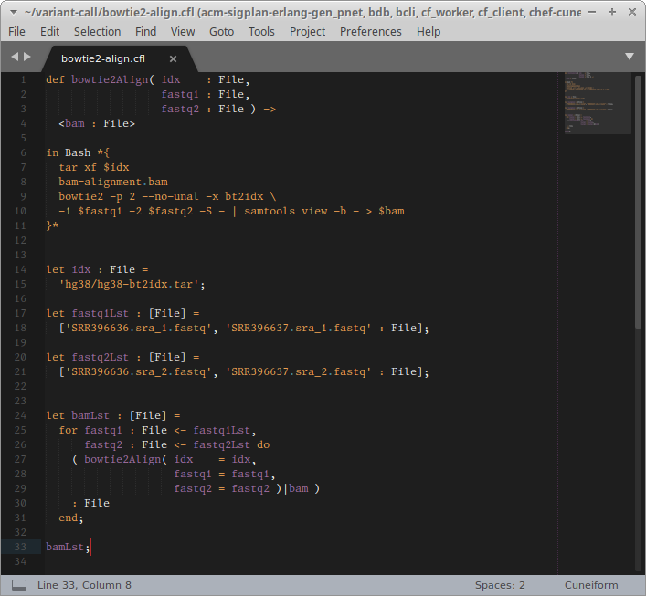

# cuneiform-sublime
###### Syntax highlighting for Cuneiform in Sublime Text 3

## Installation

### Package Control

In the main menu open **Preferences** - **Package Control** and click **Package Control: Install Package** which opens a search dialog. Enter `Cuneiform`.

### Manual Installation

Copy the file `Cuneiform.sublime-syntax` into your home directory under `~/.config/sublime-text-3/Packages/User`

    cp Cuneiform.sublime-syntax ~/.config/sublime-text-3/Packages/User

## Authors

- Jörgen Brandt ([@joergen7](https://github.com/joergen7/)) [joergen@cuneiform-lang.org](mailto:joergen@cuneiform-lang.org)

## License

[Apache 2.0](https://www.apache.org/licenses/LICENSE-2.0.html)
